# Project development using cursor & mcp

Cursor의 AI Agent 기능과 MCP(Multi-modal Communication Protocol)의 연동 능력을 활용하여 프로젝트 기획, 설계, 개발, 그리고 Notion 및 GitHub를 통한 협업 관리까지의 전 과정을 예시 프롬프트를 통해 보여주기위한 목적이 있습니다.

[https://github.com/724thomas/vibe\_coding\_cursor-mcp](https://github.com/724thomas/vibe_coding_cursor-mcp)


## Step1. 프로젝트 목표 및 범위 정의

/Generate Cursor Rules\
\# Tasks\
\- 프로젝트 목표 및 범위 정의 문서를 룰 파일로 작성해줘.

\# 문제점\
\- 온라인 쇼핑을 할 때 특정 상품에 대한 최저가를 찾는데 시간이 많이 소요되고 귀찮아서 대신 검색해서 리스트업 해 줄 Agent가 필요해 \
\- 프로토타입용 최대한 단순한 챗봇형태로 만들고 싶어

\# 항목\
\- 목표, 범위\
\- 항목외에는 작성하지마

\*이미 기획 및 설계 문서가 있다면 해당 내용 기반으로 요약 및 정리해 달라고 하면 됩니다.\
\*모든 과정을 직접 검수해야 합니다.\
\*Rule Type 설정: Agent Requested, 상품 최저가 검색 에이전트 PRD (Product Requirements Document)

<details>

<summary>project-goal-and-scope.mdc</summary>

## 프로젝트 목표 및 범위 정의

### 프로젝트 목표

#### 핵심 목표

온라인 쇼핑 시 특정 상품의 최저가를 자동으로 검색하고 리스트업해주는 챗봇형 Agent 개발

#### 해결하고자 하는 문제점

* **시간 소모**: 온라인 쇼핑에서 특정 상품의 최저가를 찾는데 많은 시간이 소요됨
* **번거로움**: 여러 쇼핑몰을 일일이 확인해야 하는 불편함
* **효율성 부족**: 수동으로 가격을 비교하는 비효율적인 과정

#### 기대 효과

* 상품 가격 비교 시간 단축
* 자동화된 최저가 검색으로 편의성 향상
* 더 나은 쇼핑 결정을 위한 정보 제공

### 프로젝트 범위

#### 포함 범위 (In Scope)

1. **프로토타입 개발**
   * 최대한 단순한 챗봇 형태의 인터페이스
   * 기본적인 상품 검색 기능
   * 가격 비교 및 리스트업 기능
2. **핵심 기능**
   * 사용자 입력 받기 (상품명, 카테고리 등)
   * Agent를 통한 웹검색 MCP 호출 및 데이터 수집
   * 상품 정보 검증 및 가격 비교
   * 결과 리스트 제공
3. **기술 스택**
   * 간단한 웹 기반 챗봇 인터페이스
   * Agent 기반 아키텍처
   * 웹검색 MCP 연동
   * 데이터 검증 및 가격 비교 로직

#### 제외 범위 (Out of Scope)

1. **고급 기능**
   * 복잡한 AI/ML 모델 구현
   * 실시간 가격 추적 알림
   * 사용자 계정 관리 시스템
   * 모바일 앱 개발
2. **상용화 기능**
   * 결제 시스템 연동
   * 광고 및 수익화 모델
   * 대규모 트래픽 처리
   * 고급 보안 기능
3. **확장 기능**
   * 다국가 쇼핑몰 지원
   * 상품 리뷰 분석
   * 가격 예측 기능
   * 소셜 미디어 연동

</details>


## Step2. 사용자 시나리오 MDC 작성 시키기

/Generate Cursor Rules\
\# Task\
\- 사용자 시나리오 룰 파일 작성해줘.\
\- 룰 파일에 mermaid로 다이어그램 그려줘

\# 참고할 파일들\
\- @목표및범위.mdc

\# 항목\
\- 페르소나, 정황, 사용자의 목표, 사용자의 작업 및 행동, 시나리오, 기대효과 또는 결과 - 항목외에는 작성하지마

<details>

<summary>user-scenarios.mdc</summary>

## 사용자 시나리오 정의

### 페르소나 (Persona)

#### 주요 사용자: 바쁜 직장인 김미래 (30대)

* **직업**: IT 회사 프로젝트 매니저
* **라이프스타일**:
  * 평일 야근이 잦아 개인 시간이 부족
  * 온라인 쇼핑을 선호하지만 가격 비교할 시간 부족
  * 스마트폰과 노트북을 자주 사용
* **쇼핑 패턴**:
  * 월 2-3회 온라인 쇼핑
  * 전자제품, 생활용품, 의류 등 다양한 카테고리 구매
  * 가격 대비 성능을 중시하는 합리적 소비자
* **기술 친숙도**: 중상급 (챗봇, 앱 사용에 익숙)

#### 보조 사용자: 대학생 이절약 (20대)

* **특징**: 제한된 예산으로 최대한 저렴한 상품을 찾으려 함
* **니즈**: 시간은 있지만 효율적인 가격 비교 방법을 원함

### 정황 (Context)

#### 현재 상황

* **문제 상황**:
  * 여러 쇼핑몰을 돌아다니며 가격을 비교하는 것이 번거로움
  * 같은 상품이라도 쇼핑몰마다 가격이 다름

#### 환경적 요인

* **시간 제약**: 점심시간이나 퇴근 후 짧은 시간에 쇼핑 결정 필요
* **정보 과부하**: 너무 많은 쇼핑몰과 상품 정보로 인한 선택의 어려움

### 사용자의 목표 (User Goals)

#### 주요 목표

1. **시간 절약**: 가격 비교 시간을 최소화하고 싶음
2. **최적 가격 발견**: 원하는 상품의 최저가를 빠르게 찾고 싶음
3. **간편한 사용**: 복잡한 과정 없이 간단하게 사용하고 싶음

#### 부차적 목표

* 할인 혜택이나 쿠폰 정보도 함께 확인하고 싶음
* 배송비도 알고 싶음

### 사용자의 작업 및 행동 (User Tasks & Actions)

#### 현재 워크플로우 (As-Is)

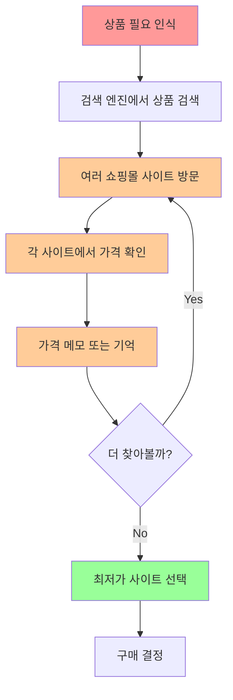

#### 목표 워크플로우 (To-Be)

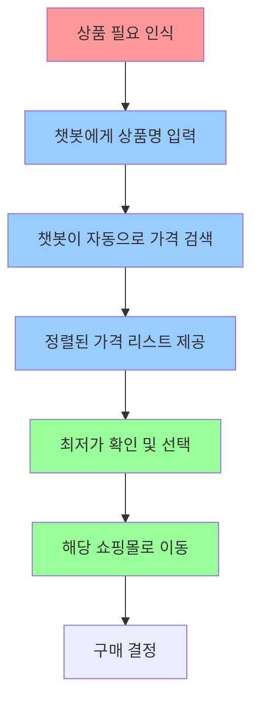

### 시나리오 (Scenarios)

#### 쇼핑

**상황**: 사용자가 원하는 상품의 최저가를 찾고 싶어하는 상황

**행동 플로우**:

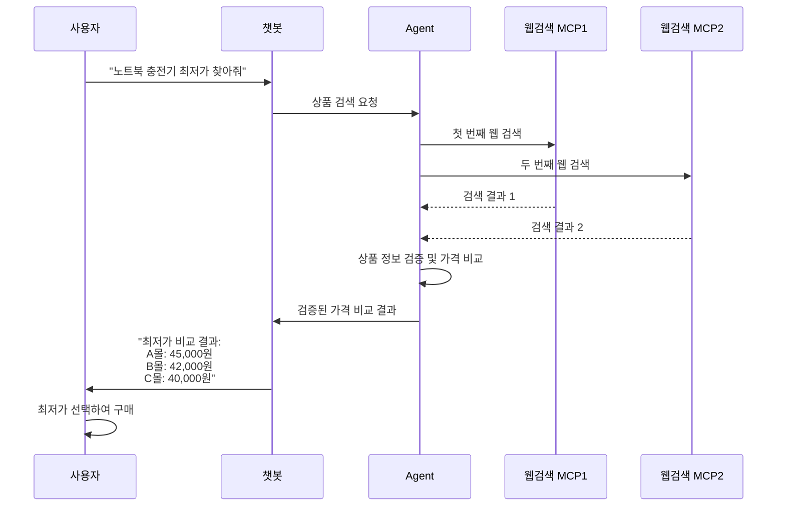

### 기대효과 또는 결과 (Expected Outcomes)

#### 정량적 효과

* **시간 절약**: 기존 15-30분 → 목표 2-3분 (80-90% 시간 단축)
* **가격 절약**: 평균 5-15% 더 저렴한 가격으로 구매 가능
* **검색 효율성**: 3-5개 사이트 방문 → 1번의 챗봇 대화로 완료

#### 정성적 효과

* **사용자 만족도 향상**: 쇼핑 스트레스 감소
* **편의성 증대**: 언제 어디서나 쉽게 가격 비교 가능
* **합리적 소비**: 더 나은 구매 결정을 통한 만족도 증가

#### 사용자별 기대 결과

**김미래 (바쁜 직장인)**

* 점심시간이나 업무 중 틈틈이 빠른 가격 비교
* 야근으로 인한 피로감 속에서도 쉽게 최저가 발견
* 시간 절약으로 인한 여유시간 확보

**이절약 (대학생)**

* 한정된 용돈으로 최대한 많은 것을 구매할 수 있게 됨
* 가격 비교하는 재미와 성취감
* 친구들에게 좋은 정보 공유 가능

</details>


## Step3. 요구사항 정의서 MDC 작성 시키기

/Generate Cursor Rules # Task\
\- PRD 룰 파일 작성해줘

\# 요구사항\
\- 프로토타입용 단순한 챗봇형태\
\- 챗봇 응답은 실시간 스트리밍 SSE 방식\
\- 멀티턴으로 과거 대화 내용 참조하여 응답\
\- langgraph의 pre-built된 react agent 사용\
\- 상품명을 자유롭게 입력\
\- 직접 쇼핑몰에서 스크래핑하지 말고 MCP 인터넷 검색툴들 연동해서 검색\
\- 검색된 상품들의 가격이나 할인 배송 정보 구매링크 등 가져와서 리스트업해서 보여주기 - agent와 파싱은 LLM gemini-2.5-flash-preview-05-20 로 개발\
\- 1회성이라서 데이터베이스는 따로 사용할 필요 없어\
\- 인증 연결안할거고 보안도 신경쓰지마

\# 참고할 파일들\
\- @목표및범위.mdc, @사용자시나리오.mdc

\# 항목\
\- 제품 개요 및 목적, 핵심 고객/사용자, 문제 정의, 비즈니스 목표 및 성공 지표, 요구사항(기능/비기능), 유저 흐름 및 시나리오, 제약사항 및 전제조건, 성공의 정의(KPI) \
\- 항목외에는 작성하지마

<details>

<summary>prd.mdc</summary>


## PRD (Product Requirements Document)

### 제품 개요 및 목적

#### 제품명

**온라인 쇼핑 최저가 검색 챗봇 Agent**

#### 목적

온라인 쇼핑 시 특정 상품의 최저가를 자동으로 검색하고 비교하여 리스트업해주는 프로토타입 챗봇 개발

#### 비전

사용자가 상품명을 입력하면 즉시 여러 쇼핑몰의 가격을 비교하여 최적의 구매 선택을 도와주는 심플한 AI 어시스턴트

#### 핵심 가치 제안

* **시간 절약**: 수동 가격 비교 시간을 90% 단축
* **정보 통합**: 여러 쇼핑몰 정보를 한 곳에서 확인
* **실시간 대화**: 자연스러운 대화형 인터페이스

### 핵심 고객/사용자

#### 주요 타겟

**바쁜 직장인 (30대)**: 김미래 페르소나

* 시간 부족으로 인한 효율적 쇼핑 니즈
* 가격 대비 성능을 중시하는 합리적 소비자
* 기술 친화적이며 챗봇 사용에 익숙

#### 보조 타겟

**예산 제약 대학생 (20대)**: 이절약 페르소나

* 제한된 예산으로 최대한 저렴한 상품 추구
* 효율적인 가격 비교 방법 선호

#### 사용자 특성

* 온라인 쇼핑 경험 보유
* 웹 인터페이스 사용 가능
* 즉시성과 편의성을 중시

### 문제 정의

#### 핵심 문제

1. **시간 소모**: 여러 쇼핑몰을 일일이 확인하는 번거로움
2. **정보 분산**: 각 쇼핑몰마다 다른 가격 및 할인 정보
3. **비효율성**: 수동 가격 비교의 한계
4. **놓치는 정보**: 할인 쿠폰, 배송비 등의 부가 정보 누락

#### 현재 해결책의 한계

* 기존 가격 비교 사이트: 업데이트 지연, 제한적 정보
* 수동 검색: 시간 소모적, 휴먼 에러 발생
* 개별 쇼핑 앱: 파편화된 정보, 비교 불가

### 비즈니스 목표 및 성공 지표

#### 비즈니스 목표

1. **사용자 경험 개선**: 쇼핑 결정 시간 단축
2. **기술 검증**: LangGraph + MCP 아키텍처 검증
3. **MVP 검증**: 시장 니즈 및 사용성 검증

#### 핵심 성공 지표 (KPI)

* **사용성**: 평균 검색 완료 시간 3분 이내
* **정확성**: 가격 정보 정확도 95% 이상
* **만족도**: 사용자 만족도 4.0/5.0 이상
* **재사용**: 사용자 재사용률 70% 이상

### 요구사항

#### 기능 요구사항 (Functional Requirements)

**1. 챗봇 인터페이스**

* **실시간 스트리밍**: SSE(Server-Sent Events) 방식으로 응답 제공
* **멀티턴 대화**: 과거 대화 내용 참조하여 컨텍스트 유지
* **자연어 입력**: 자유로운 상품명 입력 지원

**2. 상품 검색 기능**

* **MCP 연동**: 인터넷 검색 MCP 도구들을 활용한 검색
* **Agent 기반**: LangGraph의 pre-built React Agent 사용
* **검색 범위**: 다양한 온라인 쇼핑몰 정보 수집

**3. 정보 처리 및 제공**

* **가격 비교**: 수집된 상품 가격 정보 비교 분석
* **부가 정보**: 할인, 배송, 구매링크 등 종합 정보 제공
* **결과 리스트**: 정렬된 가격 비교 결과 표시

**4. 데이터 파싱**

* **LLM 활용**: Gemini-2.5-flash-preview-05-20 모델 사용
* **정보 추출**: LLM으로 웹 검색 결과에서 상품 정보 파싱
* **검증**: LLM으로 상품 정보의 일치성 및 정확성 검증

#### 비기능 요구사항 (Non-Functional Requirements)

**1. 성능**

* **응답 시간**: 검색 요청 후 5분 이내 결과 제공
* **스트리밍**: 실시간 응답 스트리밍으로 대기 시간 최소화

**2. 신뢰성**

* **에러 처리**: 검색 실패 시 적절한 에러 메시지 제공
* **대체 방안**: MCP 검색 실패 시 다른 검색 소스 활용(langchain 혹은 langgraph의 인터넷 검색 툴)
* **데이터 검증**: 수집된 정보의 유효성 검증

**3. 사용성**

* **직관적 UI**: 간단하고 명확한 챗봇 인터페이스
* **접근성**: 웹 브라우저 기반 접근 지원
* **피드백**: 검색 진행 상황 실시간 표시

### 유저 흐름 및 시나리오

#### 기본 사용자 플로우

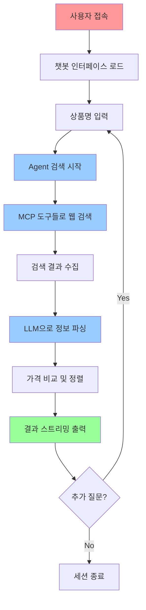

#### 상세 시나리오

참조: @user-scenarios.mdc - 쇼핑 시나리오

**예시 대화 플로우**:

1. 사용자: "노트북 충전기 최저가 찾아줘"
2. 시스템: \[실시간 스트리밍으로 검색 진행 상황 표시]
3. 시스템: 가격 비교 결과 및 구매 링크 제공
4. 사용자: "당일 배송 가능한 곳만 보여줘"
5. 시스템: 필터링된 결과 제공

### 제약사항 및 전제조건

#### 기술적 제약사항

* **프로토타입 수준**: 완성도보다는 개념 검증에 집중
* **1회성 서비스**: 1회성 검색용으로 데이터베이스는 사용할 필요 없음
* **MCP 의존성**: 인터넷 검색 MCP 도구의 가용성에 의존
* **LLM 한계**: Gemini 모델의 응답 품질 및 속도 제약
* **실시간성**: 웹 검색 결과의 실시간성 한계

#### 법적/윤리적 제약사항

* **웹 스크래핑 금지**: 직접 쇼핑몰 스크래핑 대신 MCP 도구 활용
* **개인정보**: 최소한의 개인정보 수집 및 저장
* **저작권**: 수집된 정보의 적절한 출처 표시

#### 운영 제약사항

* **개발 리소스**: 제한된 개발 시간 및 인력
* **비용**: 무료/저비용 솔루션 우선
* **확장성**: 초기 버전은 소규모 사용자 대상

### 성공의 정의 (KPI)

#### 사용성 지표

* [ ] **검색 완료 시간**: 평균 5분 이내
* [ ] **성공률**: 검색 성공률 90% 이상
* [ ] **에러율**: 시스템 에러 5% 이하

#### 품질 지표

* [ ] **정확도**: 가격 정보 정확도 95% 이상
* [ ] **완성도**: 필수 정보(가격, 링크) 포함률 90% 이상
* [ ] **응답성**: 스트리밍 응답 지연 시간 2초 이하

#### 사용자 만족도 지표

* [ ] **만족도**: 사용자 만족도 점수 4.0/5.0 이상
* [ ] **재사용률**: 사용자 재사용률 70% 이상
* [ ] **완료율**: 검색 \~ 결과 확인 완료율 80% 이상

#### 비즈니스 지표

* [ ] **시간 절약**: 기존 대비 80% 이상 시간 단축
* [ ] **정보 통합**: 3개 이상 쇼핑몰 정보 동시 제공
* [ ] **기술 검증**: LangGraph + MCP 아키텍처 안정성 확인

</details>


## Step4. 기술스택 문서 MDC 작성 시키기

/Generate Cursor Rules\
\# Task\
\- 기술 스택 룰파일 작성해줘

\# 기술 스택\
\- language: python 3.11\
\- backend(api): fastapi\
\- frontend: streamlit\
\## Agent\
\- langgraph, langsmith\
\- mcp tools: Naver search, Exa search\
\- llm: gemini-2.5-flash-preview-05-20 \
\- memory: 랭그래프 로컬 메모리 모듈

\# 참고할 파일들 - @prd.mdc

\# 항목\
\- 프론트엔드, 백엔드, Agent \
\- 항목외에는 작성하지마

<details>

<summary>tech-stack.mdc</summary>


## 기술 스택 (Tech Stack)

### 프론트엔드 (Frontend)

#### Streamlit

* **언어**: Python 3.11
* **프레임워크**: Streamlit
* **용도**: 챗봇 인터페이스 구현
* **주요 기능**:
  * 상품 검색 결과 표시

### 백엔드 (Backend)

#### FastAPI

* **언어**: Python 3.11
* **프레임워크**: FastAPI
* **용도**: API 서버 및 Agent 연동
* **주요 기능**:
  * RESTful API 엔드포인트
  * Agent 호출 및 결과 처리

#### 주요 라이브러리

* **FastAPI**: 웹 프레임워크
* **uvicorn**: ASGI 서버

### Agent

#### LangGraph

* **프레임워크**: LangGraph
* **Agent 타입**: Pre-built React Agent, single turn
* **모니터링**: LangSmith 연동, .env에 LANGSMITH\_API\_KEY 설정

#### LLM

* **모델**: Gemini-2.5-flash-preview-05-20
* **용도**:
  * React Agent로 덕덕고 Tool로 인터넷 검색해서 결과를 받아서 처리

#### Tools

* **LangChain DuckDuckGo**: LangChain의 DuckDuckGo Search Tool
* **용도**: 웹 검색

</details>


## Step5. 시스템 아키텍처 MDC 작성 시키기

/Generate Cursor Rules\
\# Task\
\- 시스템 아키텍처 그려줘\
\- 다이어그램은 룰 파일에 mermaid로 그려줘

\# 참고할 파일들\
\- @prd.mdc, @기술스택.mdc

\# 항목\
\- 아키텍처 구성요소, 계층 구조, 모듈화 및 컴포넌트, 데이터 흐름, API 및 인터페이스, 시스템 외부 환경과의 관계\
\- 항목외에는 작성하지마

<details>

<summary>system-architecture.mdc</summary>


## 시스템 아키텍처 (System Architecture)

### 아키텍처 구성요소

#### 전체 시스템 아키텍처

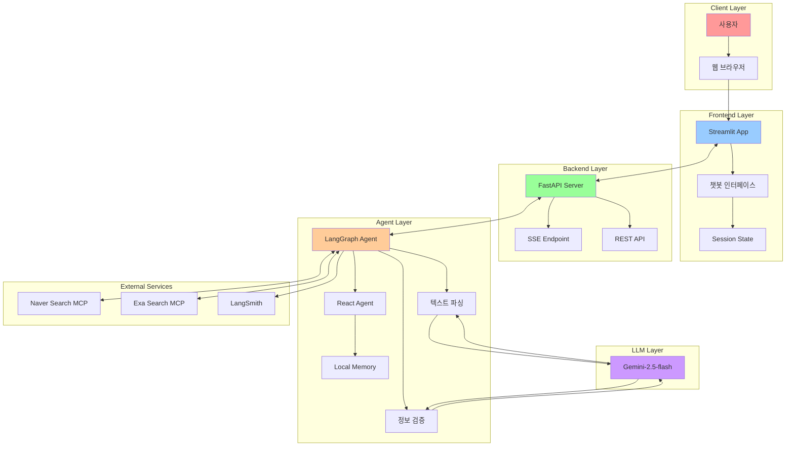

### 계층 구조

#### 5계층 아키텍처

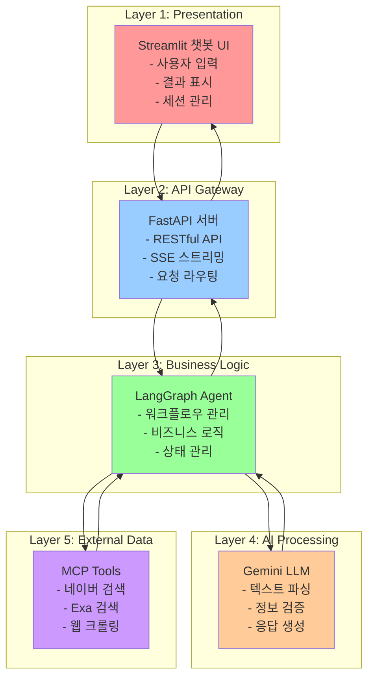

### 모듈화 및 컴포넌트

#### 컴포넌트 다이어그램

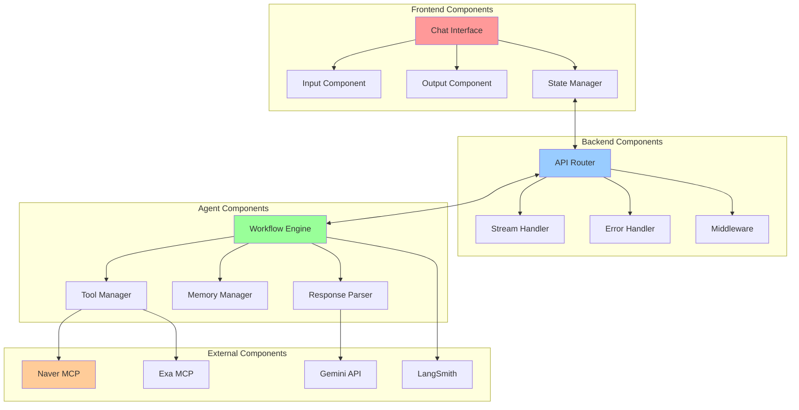

### 데이터 흐름

#### 상품 검색 데이터 플로우

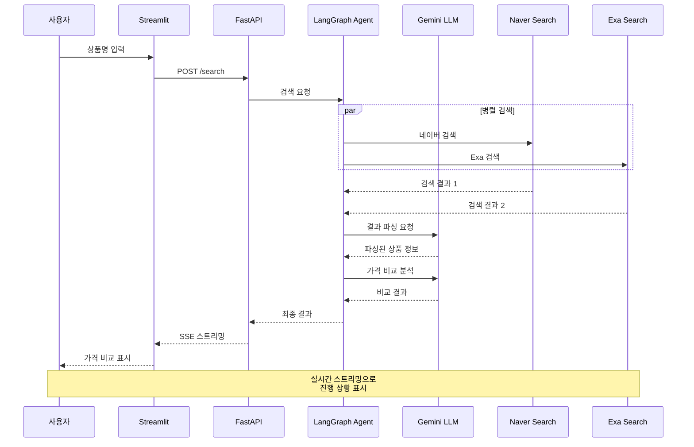

#### 메모리 및 세션 관리

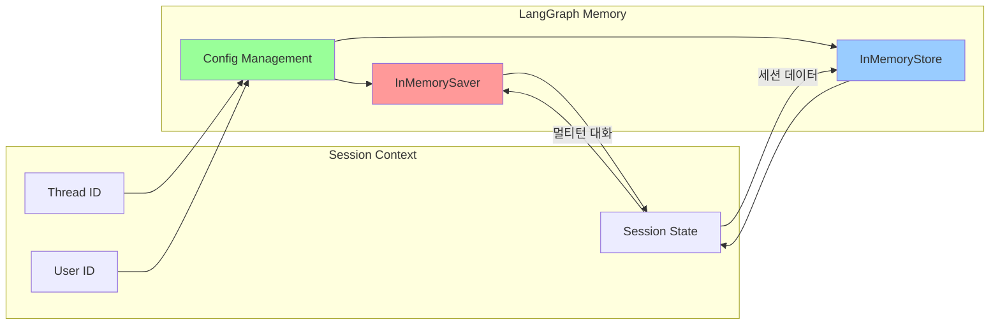

### API 및 인터페이스

#### API 엔드포인트 구조

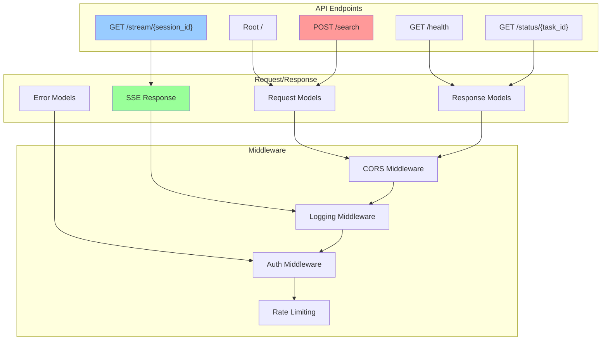

#### 인터페이스 정의

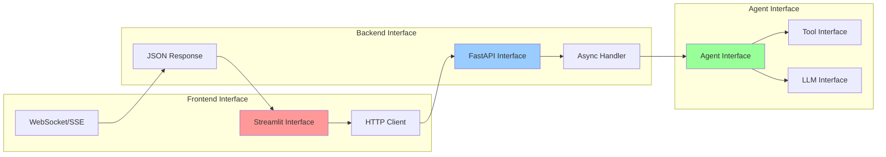

### 시스템 외부 환경과의 관계

#### 외부 시스템 연동

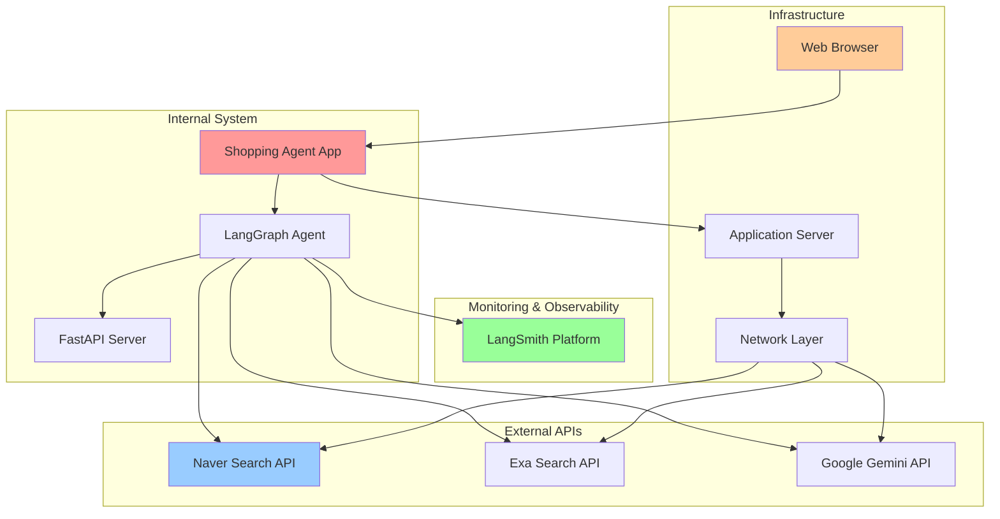

</details>


## Step6. UX 와이어프레임 MD 작성 시키기

프롬프트 예시

\# Task\
\- UX 와이어프레임 md 파일 docs폴더에 작성해줘\
\- 와이어 프레임은 SVG 파일로 따로 만들어서 룰 파일에 삽입시켜줘 - 웹 ux만 그려줘

\# 참고할 파일들\
\- @prd.mdc, @시스템아키텍쳐.mdc

\# 항목\
\- ux 와이어 프레임\
\- 항목외에는 작성하지마

<details>

<summary>ux-wireframes.md</summary>

## UX 와이어프레임

### 데스크톱 인터페이스

#### 메인 채팅 인터페이스

**주요 구성 요소:**

* **헤더**: 서비스 제목과 브랜딩
* **채팅 영역**: 사용자와 봇 간의 대화 표시
* **메시지 버블**: 사용자(우측 파란색), 봇(좌측 회색/녹색)
* **가격 비교 테이블**: 쇼핑몰별 원가, 할인가, 할인율, 배송비, 총액, 절약액, 구매 링크
* **입력 영역**: 메시지 입력창과 전송 버튼
* **상태 표시**: 온라인 상태 및 사용 팁

**기능적 특징:**

* SSE 스트리밍으로 실시간 검색 진행 상황 표시
* 총액(할인가+배송비)별 정렬된 결과 테이블
* 할인율 및 배송비 구분 표시
* 직접 구매 링크 제공

</details>

<details>

<summary>chat-interface-wireframe.svg</summary>

```xml
<svg width="800" height="600" xmlns="http://www.w3.org/2000/svg">
  <!-- Background -->
  <rect width="800" height="600" fill="#f8f9fa" stroke="#dee2e6" stroke-width="2"/>
  
  <!-- Header -->
  <rect x="0" y="0" width="800" height="60" fill="#343a40"/>
  <text x="20" y="35" font-family="Arial, sans-serif" font-size="18" font-weight="bold" fill="white">🛒 온라인 쇼핑 최저가 검색 챗봇</text>
  
  <!-- Main Chat Area -->
  <rect x="20" y="80" width="760" height="420" fill="white" stroke="#dee2e6" stroke-width="1" rx="8"/>
  
  <!-- Chat Messages Area -->
  <text x="40" y="110" font-family="Arial, sans-serif" font-size="12" fill="#6c757d">채팅 메시지 영역</text>
  
  <!-- User Message Bubble -->
  <rect x="450" y="130" width="300" height="40" fill="#007bff" stroke="#0056b3" stroke-width="1" rx="20"/>
  <text x="470" y="155" font-family="Arial, sans-serif" font-size="14" fill="white">노트북 충전기 최저가 찾아줘</text>
  
  <!-- Bot Message Bubble -->
  <rect x="50" y="190" width="350" height="80" fill="#f8f9fa" stroke="#dee2e6" stroke-width="1" rx="20"/>
  <text x="70" y="215" font-family="Arial, sans-serif" font-size="12" fill="#495057">🤖 검색 중입니다...</text>
  <text x="70" y="235" font-family="Arial, sans-serif" font-size="12" fill="#495057">• 네이버 쇼핑 검색 중</text>
  <text x="70" y="250" font-family="Arial, sans-serif" font-size="12" fill="#495057">• Exa 검색 중</text>
  <text x="70" y="265" font-family="Arial, sans-serif" font-size="12" fill="#495057">• 가격 정보 분석 중</text>
  
  <!-- Result Message Bubble -->
  <rect x="50" y="290" width="500" height="160" fill="#d4edda" stroke="#c3e6cb" stroke-width="1" rx="20"/>
  <text x="70" y="315" font-family="Arial, sans-serif" font-size="14" font-weight="bold" fill="#155724">💰 최저가 검색 결과</text>
  
  <!-- Price Comparison Table -->
  <rect x="70" y="325" width="460" height="115" fill="white" stroke="#dee2e6" stroke-width="1" rx="4"/>
  
  <!-- Table Header -->
  <rect x="70" y="325" width="460" height="25" fill="#f8f9fa" stroke="#dee2e6" stroke-width="1"/>
  <text x="80" y="342" font-family="Arial, sans-serif" font-size="10" font-weight="bold" fill="#495057">쇼핑몰</text>
  <text x="150" y="342" font-family="Arial, sans-serif" font-size="10" font-weight="bold" fill="#495057">원가</text>
  <text x="200" y="342" font-family="Arial, sans-serif" font-size="10" font-weight="bold" fill="#495057">할인가</text>
  <text x="260" y="342" font-family="Arial, sans-serif" font-size="10" font-weight="bold" fill="#495057">할인율</text>
  <text x="310" y="342" font-family="Arial, sans-serif" font-size="10" font-weight="bold" fill="#495057">배송비</text>
  <text x="360" y="342" font-family="Arial, sans-serif" font-size="10" font-weight="bold" fill="#495057">총액</text>
  <text x="420" y="342" font-family="Arial, sans-serif" font-size="10" font-weight="bold" fill="#495057">절약액</text>
  <text x="480" y="342" font-family="Arial, sans-serif" font-size="10" font-weight="bold" fill="#495057">구매</text>
  
  <!-- Table Rows -->
  <!-- Row 1 - Best Deal -->
  <rect x="70" y="350" width="460" height="30" fill="#d4edda" stroke="#c3e6cb" stroke-width="1"/>
  <text x="75" y="360" font-family="Arial, sans-serif" font-size="8" font-weight="bold" fill="#155724">🥇 최저가</text>
  <text x="80" y="375" font-family="Arial, sans-serif" font-size="10" fill="#495057">C전자몰</text>
  <text x="150" y="375" font-family="Arial, sans-serif" font-size="9" fill="#6c757d" text-decoration="line-through">50,000원</text>
  <text x="200" y="375" font-family="Arial, sans-serif" font-size="10" font-weight="bold" fill="#dc3545">39,900원</text>
  <rect x="260" y="365" width="25" height="15" fill="#dc3545" rx="3"/>
  <text x="268" y="374" font-family="Arial, sans-serif" font-size="8" fill="white">20%</text>
  <text x="310" y="375" font-family="Arial, sans-serif" font-size="9" fill="#28a745">무료</text>
  <text x="360" y="375" font-family="Arial, sans-serif" font-size="10" font-weight="bold" fill="#dc3545">39,900원</text>
  <text x="420" y="375" font-family="Arial, sans-serif" font-size="9" fill="#28a745">-10,100원</text>
  <rect x="480" y="365" width="35" height="15" fill="#007bff" rx="3"/>
  <text x="490" y="374" font-family="Arial, sans-serif" font-size="8" fill="white">구매</text>
  
  <!-- Row 2 -->
  <line x1="70" y1="380" x2="530" y2="380" stroke="#dee2e6"/>
  <text x="80" y="395" font-family="Arial, sans-serif" font-size="10" fill="#495057">B쇼핑</text>
  <text x="150" y="395" font-family="Arial, sans-serif" font-size="9" fill="#6c757d" text-decoration="line-through">52,000원</text>
  <text x="200" y="395" font-family="Arial, sans-serif" font-size="10" fill="#495057">41,500원</text>
  <rect x="260" y="385" width="25" height="15" fill="#ffc107" rx="3"/>
  <text x="268" y="394" font-family="Arial, sans-serif" font-size="8" fill="white">20%</text>
  <text x="310" y="395" font-family="Arial, sans-serif" font-size="9" fill="#495057">2,500원</text>
  <text x="360" y="395" font-family="Arial, sans-serif" font-size="10" fill="#495057">44,000원</text>
  <text x="420" y="395" font-family="Arial, sans-serif" font-size="9" fill="#28a745">-8,000원</text>
  <rect x="480" y="385" width="35" height="15" fill="#007bff" rx="3"/>
  <text x="490" y="394" font-family="Arial, sans-serif" font-size="8" fill="white">구매</text>
  
  <!-- Row 3 -->
  <line x1="70" y1="400" x2="530" y2="400" stroke="#dee2e6"/>
  <text x="80" y="415" font-family="Arial, sans-serif" font-size="10" fill="#495057">A마트</text>
  <text x="150" y="415" font-family="Arial, sans-serif" font-size="9" fill="#6c757d" text-decoration="line-through">48,000원</text>
  <text x="200" y="415" font-family="Arial, sans-serif" font-size="10" fill="#495057">43,000원</text>
  <rect x="260" y="405" width="25" height="15" fill="#17a2b8" rx="3"/>
  <text x="268" y="414" font-family="Arial, sans-serif" font-size="8" fill="white">10%</text>
  <text x="310" y="415" font-family="Arial, sans-serif" font-size="9" fill="#28a745">무료</text>
  <text x="360" y="415" font-family="Arial, sans-serif" font-size="10" fill="#495057">43,000원</text>
  <text x="420" y="415" font-family="Arial, sans-serif" font-size="9" fill="#28a745">-5,000원</text>
  <rect x="480" y="405" width="35" height="15" fill="#007bff" rx="3"/>
  <text x="490" y="414" font-family="Arial, sans-serif" font-size="8" fill="white">구매</text>
  
  <!-- Input Area -->
  <rect x="20" y="520" width="760" height="60" fill="white" stroke="#dee2e6" stroke-width="1" rx="8"/>
  
  <!-- Input Box -->
  <rect x="40" y="540" width="600" height="25" fill="white" stroke="#ced4da" stroke-width="1" rx="4"/>
  <text x="50" y="557" font-family="Arial, sans-serif" font-size="12" fill="#6c757d">메시지를 입력하세요...</text>
  
  <!-- Send Button -->
  <rect x="660" y="540" width="100" height="25" fill="#007bff" stroke="#0056b3" stroke-width="1" rx="4"/>
  <text x="695" y="557" font-family="Arial, sans-serif" font-size="12" font-weight="bold" fill="white">전송</text>
  
  <!-- Status Indicator -->
  <circle cx="740" cy="100" r="6" fill="#28a745"/>
  <text x="720" y="120" font-family="Arial, sans-serif" font-size="10" fill="#28a745">온라인</text>
  
  <!-- Sidebar Info -->
  <rect x="600" y="130" width="160" height="100" fill="#f8f9fa" stroke="#dee2e6" stroke-width="1" rx="4"/>
  <text x="610" y="150" font-family="Arial, sans-serif" font-size="12" font-weight="bold" fill="#495057">💡 사용 팁</text>
  <text x="610" y="170" font-family="Arial, sans-serif" font-size="10" fill="#6c757d">• 구체적인 상품명 입력</text>
  <text x="610" y="185" font-family="Arial, sans-serif" font-size="10" fill="#6c757d">• 브랜드명 포함 권장</text>
  <text x="610" y="200" font-family="Arial, sans-serif" font-size="10" fill="#6c757d">• 가격대 필터 가능</text>
  <text x="610" y="215" font-family="Arial, sans-serif" font-size="10" fill="#6c757d">• 할인율 순 정렬 가능</text>
</svg> 
```

</details>


## Step7. API 명세서 MDC 작성시키기

/Generate Cursor Rules\
\# Task\
\- 심플하게 api 명세서 룰 작성해줘 - 테이블로 작성해줘\
\- 인증, 권한, 보안 등 내용은 빼줘

\# 참고할 파일들\
\- @prd.mdc, @시스템아키텍쳐.mdc

\# 항목\
\- 엔드포인트 URL, HTTP 메서드, 요청 파라미터, 요청 예시, 응답구조 - 항목외에는 작성하지마

<details>

<summary>api-specification.mdc</summary>

## API 명세서 (API Specification)

### FastAPI 엔드포인트

| 엔드포인트                  | HTTP 메서드 | 요청 파라미터                                       | 요청 예시                                                | 응답 구조                                                        |
| ---------------------- | -------- | --------------------------------------------- | ---------------------------------------------------- | ------------------------------------------------------------ |
| `/`                    | GET      | 없음                                            | `GET /`                                              | `{"message": "온라인 쇼핑 최저가 검색 챗봇 API"}`                        |
| `/search`              | POST     | `{"query": "string", "session_id": "string"}` | `{"query": "노트북 충전기 최저가", "session_id": "user_123"}` | `{"task_id": "string", "status": "processing"}`              |
| `/stream/{session_id}` | GET      | `session_id`: 세션 식별자                          | `GET /stream/user_123`                               | SSE 스트림 응답                                                   |
| `/health`              | GET      | 없음                                            | `GET /health`                                        | `{"status": "healthy", "timestamp": "2024-01-01T00:00:00Z"}` |

### 요청/응답 상세

#### POST /search

**요청 파라미터:**

* `query` (string, required): 검색할 상품명
* `session_id` (string, required): 사용자 세션 식별자

**요청 예시:**

```json
{
  "query": "아이폰 15 케이스",
  "session_id": "user_123"
}
```

**응답 구조:**

```json
{
  "task_id": "task_abc123",
  "status": "processing",
  "message": "검색을 시작합니다."
}
```

#### GET /stream/{session\_id}

**요청 파라미터:**

* `session_id` (path parameter): 세션 식별자

**요청 예시:**

```
GET /stream/user_123
Accept: text/event-stream
```

**응답 구조 (SSE):**

```
event: progress
data: {"step": "searching", "message": "네이버 쇼핑 검색 중..."}

event: progress  
data: {"step": "parsing", "message": "가격 정보 분석 중..."}

event: result
data: {
  "products": [
    {
      "shop_name": "C전자몰",
      "original_price": 50000,
      "discount_price": 39900,
      "discount_rate": 20,
      "shipping_cost": 0,
      "total_price": 39900,
      "savings": 10100,
      "purchase_url": "https://example.com/product/123"
    }
  ],
  "summary": {
    "lowest_price": 39900,
    "avg_savings": 6525,
    "free_shipping_count": 2
  }
}

event: complete
data: {"message": "검색이 완료되었습니다."}
```

#### GET /health

**요청 파라미터:** 없음

**요청 예시:**

```
GET /health
```

**응답 구조:**

```json
{
  "status": "healthy",
  "timestamp": "2024-01-01T12:00:00Z",
  "services": {
    "langgraph_agent": "running",
    "gemini_llm": "available",
    "mcp_tools": "connected"
  }
}
```

### 데이터 모델

#### Product 모델

```json
{
  "shop_name": "string",
  "original_price": "number",
  "discount_price": "number", 
  "discount_rate": "number",
  "shipping_cost": "number",
  "total_price": "number",
  "savings": "number",
  "purchase_url": "string"
}
```

#### Summary 모델

```json
{
  "lowest_price": "number",
  "avg_savings": "number",
  "free_shipping_count": "number"
}
```

#### SSE Progress 모델

```json
{
  "step": "string",
  "message": "string"
}
```

</details>


## Step8. 폴더 구조 작성

/Generate Cursor Rules

\# Task\
\- 프로젝트 폴더 구조를 룰 파일에 폴더트리 형태로 작성해줘\
\- 심플하게 백엔드, 프론트엔드 나눠서 Layered Structure 스타일로 설계해줘 - 각 폴더에 \_\_init\_\_.py 파일 추가하고\
\- 가장 기본적인 스켈레톤 코드 파일 목록만 나열해줘

\# 참고할 파일들\
\- @prd.mdc, @api.mdc

\# 항목\
\- 폴더 트리\
\- 항목외에는 작성하지마


Agent Requested

<details>

<summary>project-structure</summary>


## 프로젝트 폴더 구조 (Project Structure)

### 폴더 트리

```
vctest6/
├── backend/                           # FastAPI 백엔드
│   ├── __init__.py
│   ├── main.py                        # FastAPI 애플리케이션 엔트리포인트
│   ├── requirements.txt               # Python 의존성
│   ├── app/
│   │   ├── __init__.py
│   │   ├── api/                       # API Layer (Presentation)
│   │   │   ├── __init__.py
│   │   │   ├── routes/
│   │   │   │   ├── __init__.py
│   │   │   │   ├── chat.py            
│   │   ├── services/                  # Service Layer
│   │   │   ├── __init__.py
│   │   │   ├── agent_service.py      
│   │   ├── agents/                    # Agent Layer (AI Processing)
│   │   │   ├── __init__.py
│   │   │   ├── langgraph_agent.py     # LangGraph React Agent
│   └── tests/
│       ├── __init__.py
├── frontend/                          # Streamlit 프론트엔드
│   ├── __init__.py
├── docs/                              # 문서
│   ├── ux-wireframes.md
│   └── chat-interface-wireframe.svg
├── .cursor/
│   └── rules/
│       ├── project-scope.mdc
│       ├── user-scenarios.mdc
│       ├── prd.mdc
│       ├── tech-stack.mdc
│       ├── system-architecture.mdc
│       ├── api-specification.mdc
│       └── project-structure.mdc
├── .env                               # 환경 변수
├── .gitignore
└── README.md
```

</details>


## Step9. 태스크 정의 MDC 작성시키기

/Generate Cursor Rules\
\# Task\
\- 개발 task를 정의해줘\
\- 테이블 형태로 작성하고 해당 테이블 채팅화면에도 그려줘 \
\- 태스크를 큰 단위로 정의해줘

\# 참고할 파일들\
\- @prd.mdc, @api.mdc, @system-architecture.mdc, @tech-stack.mdc

\# 항목\
\- task id, title, description, status, dependencies, priority, details, test\_strategy \
\- 항목외에는 작성하지마

<details>

<summary>development-tasks.mdc</summary>

| Task ID  | Title                | Description                                                 | Status      | Dependencies | Priority | Details                                                                 | Test Strategy                 |
| -------- | -------------------- | ----------------------------------------------------------- | ----------- | ------------ | -------- | ----------------------------------------------------------------------- | ----------------------------- |
| TASK-001 | 프로젝트 구조 및 환경 설정      | 프로젝트 폴더 구조 생성, 의존성 설치, 환경 설정                                | Not Started | -            | High     | backend/frontend 폴더 생성, requirements.txt 작성, .env 설정, Python 3.11 환경 구성 | 폴더 구조 검증, 환경 변수 로드 테스트        |
| TASK-002 | FastAPI 백엔드 기본 구조 구현 | FastAPI 서버 기본 구조 및 API 엔드포인트 스켈레톤 구현                        | Not Started | TASK-001     | High     | main.py, API 라우터, Chat API 구현, 동기 방식 구현(not streaming)                  | API 엔드포인트 응답 테스트              |
| TASK-003 | LangGraph Agent 구현   | React Agent 설정, Gemini LLM 연동, Tool 연동, 메모리 없음(single turn) | Not Started | TASK-002     | High     | react agent 가 툴 사용해서 상품을 웹 검색하고 LLM을 통해 검색결과 생성                         | Agent 실행 테스트, LLM 응답 검증       |
| TASK-004 | Streamlit 프론트엔드 구현   | 챗봇 UI, 메시지 표시                                               | Not Started | TASK-005     | High     | 챗봇 프렌트엔드 구현                                                             | UI 컴포넌트 렌더링 테스트, 사용자 인터랙션 테스트 |

</details>


## Step10. 커서에서 노션 문서화

1. Cursor Settings > Features > Enable auto-run mode&#x20;
2. 2\. 노션에 태스크 ToDo List 추가


\# Task\
\- 태스크 정보를 노션 Database 추가해서 작성해줘. Task의 Details 컬럼은 각 태스크 페이지 안에 추가로 작성해줘\
\- database에 assign 컬럼도 추가하고 빈값으로 세팅해줘

\# 참고 파일 - @task.mdc

<figure><figcaption></figcaption></figure>

## Step11. 기본 개발 원칙 MDC 작성 (development-policy.mdc)

Rule Type: Always

\# 개발 원칙 및 가이드라인\
1\. SOLID 원칙 지키기\
2\. Clean Architecture 따르기\
3\. 파일과 함수는 최대한 작은 단위로

\# 태스크별 필수 개발 프로세스 (TDD)

1.  개발 시작

    \- 1.1. 테스트 코드 작성\
    \- 1.2. 코딩\
    \- 1.3. 테스트 시작\
    \- 1.4. 테스트 에러 없을때까지 반복 수정
2. 현재 태스크의 전체 파일 작성 완료하면 현재 태스크에 포함된 모든 테스트 진행 \
   \- 2.1. 테스트 에러 없을때까지 반복 수정

<details>

<summary>development-policy.mdc</summary>


## 개발 원칙 및 가이드라인

1. SOLID 원칙 지키기
2. Clean Architecture 따르기
3. 파일과 함수는 최대한 작은 단위로

## 태스크별 필수 개발 프로세스 (TDD)

1. 개발 시작
   * 1.1. 테스트 코드 작성
   * 1.2. 코딩
   * 1.3. 테스트 시작
   * 1.4. 테스트 에러 없을때까지 반복 수정
2. 현재 태스크의 전체 파일 작성 완료하면 현재 태스크에 포함된 모든 테스트 진행
   * 2.1. 테스트 에러 없을때까지 반복 수정

</details>


## Step12. 스켈레톤 코드 개발 계획 작성

/Generate Cursor Rules # Task

\- 스켈레톤 코드 개발 계획 룰 파일 작성해줘\
\- 기술 관련해서는 Context7 mcp 활용해서 작성해\
\- 계획 룰 파일안에 소스코드는 작성하지마\
\- 패키지 버전 명시하지마\
\- 개발 계획은 간단하게 개발할 기능명만 순서대로 작성해줘 - 더미 데이터로 전체 동작하도록 계획\
\- 룰 파일 명: skeleton-development-plan.mdc

\# 작성 항목 - 개발 계획

\# Context Files\
\- @development-tasks.mdc @api-specification.mdc @tech-stack.mdc

<details>

<summary>skeleton-development-plan.mdc</summary>


## 스켈레톤 코드 개발 계획 (Skeleton Development Plan)

### 개발 순서 및 계획

#### 1단계: 프로젝트 환경 설정

* 가상환경 설정 및 의존성 설치
* 환경 변수 설정 (.env 파일)
* 프로젝트 구조 확인

#### 2단계: Backend 기본 구조 구현

* FastAPI 애플리케이션 초기화
* 기본 라우터 설정 (/health, /)
* CORS 설정
* 기본 응답 모델 정의

#### 3단계: 더미 데이터 기반 Chat API 구현

* 채팅 요청/응답 모델 정의 (Pydantic)
* /chat 엔드포인트 구현
* 더미 응답 생성 함수
* 기본 에러 핸들링

#### 4단계: LangGraph Agent 기본 구조

* Agent 상태 모델 정의
* 더미 도구(Tool) 구현
* React Agent 기본 설정
* 메모리 없는 단일 턴 구현

#### 5단계: Gemini LLM 연동

* Gemini API 클라이언트 설정
* LLM 응답 처리 로직
* 기본 프롬프트 템플릿

#### 6단계: 더미 검색 도구 구현

* DuckDuckGo 도구 모킹
* 가짜 검색 결과 생성
* 도구 실행 로직

#### 7단계: Frontend Streamlit 기본 구조

* Streamlit 애플리케이션 초기화
* 기본 페이지 레이아웃
* 세션 상태 관리

#### 8단계: 채팅 인터페이스 구현

* st.chat\_message 컴포넌트
* st.chat\_input 컴포넌트
* 채팅 히스토리 표시
* 메시지 상태 관리

#### 9단계: Backend-Frontend 연동

* HTTP 클라이언트 설정
* API 호출 로직
* 응답 처리 및 표시
* 에러 처리

#### 10단계: 멀티턴 대화 기능

* 세션 관리 구조
* LangGraph 메모리 설정 (InMemorySaver)
* 대화 컨텍스트 유지
* 세션별 상태 관리

#### 11단계: 테스트 및 검증

* 단위 테스트 작성
* 통합 테스트 실행
* 더미 데이터 동작 확인
* 전체 플로우 검증

### 기술 스택 참고사항

#### FastAPI 주요 기능

* 라우터 기반 구조화
* Pydantic 모델 활용
* 자동 API 문서 생성
* 비동기 처리 지원

#### LangGraph 핵심 개념

* React Agent 패턴
* 상태 기반 그래프 구조
* 메모리 관리 (InMemorySaver)
* 도구 통합 및 실행

#### Streamlit 채팅 컴포넌트

* st.chat\_message로 메시지 표시
* st.chat\_input으로 사용자 입력
* st.session\_state로 상태 관리
* st.write\_stream으로 스트리밍 표시

### 더미 데이터 구조

#### 검색 결과 더미 데이터

* 상품명, 가격, 쇼핑몰 정보
* 할인율 및 배송비 정보
* 구매 링크 (가짜 URL)

#### 채팅 응답 더미 데이터

* 사전 정의된 응답 템플릿
* 상품 추천 메시지
* 가격 비교 결과 포맷

#### Agent 도구 더미 응답

* 웹 검색 결과 모킹
* 상품 정보 파싱 시뮬레이션
* 가격 비교 로직 더미 구현

### 주요 고려사항

#### 개발 순서

* TDD 원칙에 따른 테스트 우선 개발
* 기능별 점진적 구현
* 더미 데이터로 전체 플로우 우선 구현

#### 파일 구조

* Clean Architecture 원칙 적용
* 기능별 모듈 분리
* 의존성 주입 패턴 활용

#### 상태 관리

* 백엔드: LangGraph 메모리
* 프론트엔드: Streamlit 세션 상태
* 세션별 격리된 상태 관리

</details>


## Step13. 스켈레톤 코드 개발 시작

\
\# Task

* skeleton-development-plan.mdc 이 스켈레톤 코드 계획 파일대로 순차적으로 개발진행해줘
* 개발 원칙룰의 # 태스크별 필수 개발 프로세스 (TDD) 순서대로 잘 지켜서 개발해
* requirements.txt에는 패지키 버전 명시하지마 최신버전 설치되도록 해
* 지금 cursor에서 파이썬 인터프리터 파이썬 3.11로 세팅한 상황이니까 다른 가상환경 활성화 하거나 하지마


## Step14. N번 태스크 개발 계획 작성

/Generate Cursor Rules\
\# Task\
\- n번 태스크 개발 계획 룰 파일 작성해줘\
\- 계획 룰 파일안에 소스코드는 작성하지마\
\- 패키지 버전 명시하지마\
\- 필요할 경우 Context7 MCP로 기술 관련 내용 검색해서 참고해 - 개발 계획은 간단하게 개발할 기능명만 순서대로 작성해줘\
\- 룰 파일 명: taskN-plan.mdc

\# 작성 항목\
\- 구현 항목, 기술 스택 및 라이브러리, 개발 계획 # Context Files\
\- @development-tasks.mdc @tech-stack.mdc

<details>

<summary>task1-plan.mdc</summary>


## Task 1 개발 계획: 프로젝트 구조 및 환경 설정

### 구현 항목

#### 1.1 프로젝트 폴더 구조 생성

* backend 폴더 구조 설정
* frontend 폴더 구조 설정

#### 1.2 백엔드 환경 설정

* FastAPI 의존성 설치
* .env & env.example 환경 변수 파일 설정

#### 1.3 프론트엔드 환경 설정

* 기본 챗봇 UI 구조 설정

#### 1.4 개발 환경 검증

* 패키지 파일 생성

### 기술 스택 및 라이브러리

#### 백엔드

* **Python**: 3.11
* **프레임워크**: FastAPI
* **Agent**: LangGraph (React Agent)
* **LLM**: Gemini-2.5-flash-preview-05-20
* **Tools**: LangChain DuckDuckGo Search Tool
* **모니터링**: LangSmith

#### 프론트엔드

* **Python**: 3.11
* **프레임워크**: Streamlit

#### 개발 도구

* **서버**: uvicorn (ASGI 서버)
* **패키지 관리**: pip

### 개발 계획

1. **백엔드 폴더 구조 설정**
   * app 디렉토리 구조 생성
   * main.py 스켈레톤 파일 생성
   * routers 디렉토리 생성
2. **백엔드 의존성 패키지 파일 생성**
   * requirements.txt 파일 생성
3. **프론트엔드 환경 설정**
   * Streamlit 설치
   * 기본 UI 스켈레톤 구성
4. **환경 변수 설정**
   * .env 파일 생성
   * API 키 및 설정값 정의
   * LangSmith 설정
5. **requirements.txt 생성**
   * 백엔드 의존성 리스트 작성
6. **패키지 설치**
   * 패키지 설치 및 설치 확인

</details>

<details>

<summary>task2-plan.mdc</summary>


## TASK-002: FastAPI 백엔드 기본 구조 구현

### 개요

FastAPI 서버 기본 구조 및 API 엔드포인트 스켈레톤 구현을 위한 개발 계획입니다.

### 구현 항목

#### 1. 기본 FastAPI 애플리케이션 구조

* FastAPI 인스턴스 초기화
* 기본 라우터 설정

#### 2. API 라우터 구조

* 라우터 모듈 분리
* Chat API 라우터 구현
* 경로 및 태그 설정

#### 3. API 엔드포인트

* GET `/health` - 헬스체크 엔드포인트
* POST `/chat` - 채팅 API 엔드포인트 (동기 방식)
* Pydantic 모델을 활용한 요청/응답 구조 정의

### 기술 스택 및 라이브러리

#### 핵심 프레임워크

* **FastAPI**: 고성능 웹 프레임워크
* **uvicorn**: ASGI 서버

#### 주요 라이브러리

* **pydantic**: 데이터 검증 및 직렬화
* **python-dotenv**: 환경변수 관리

#### 개발 도구

* **pytest**: 테스트 프레임워크
* **httpx**: HTTP 클라이언트 (테스트용)

### 개발 계획

#### 1단계: 기본 FastAPI 앱 구조 생성

1. FastAPI 인스턴스 생성
2. 헬스체크 엔드포인트 구현

#### 2단계: 라우터 모듈 구성

1. 라우터 디렉토리 구성
2. Chat 라우터 모듈 생성
3. 메인 앱에 라우터 등록

#### 3단계: 채팅 API 엔드포인트 구현

1. 요청/응답 Pydantic 모델 정의
2. POST `/chat` 엔드포인트 구현
3. 기본 응답 로직 구현

#### 4단계: 서버 실행 및 설정

1. uvicorn 실행 설정
2. 환경변수 설정

</details>

<details>

<summary>task3-plan.mdc</summary>


## TASK-003 개발 계획: LangGraph Agent 구현

### 구현 항목

#### 1. LangGraph Agent 구현

* React Agent 설정
* Gemini LLM 연동
* DuckDuckGo Tool 연동
* 메모리 없음 (single turn)
* 상품 웹 검색 및 LLM 결과 생성

### 기술 스택 및 라이브러리

#### Agent 프레임워크

* **LangGraph**: Pre-built React Agent 사용
* **Agent 타입**: create\_react\_agent() 함수로 단일 턴 Agent 구현

#### LLM 모델

* **Gemini-2.5-flash-preview-05-20**: Google Gemini 모델 사용
* **용도**: 웹 검색 결과를 기반으로 상품 검색 결과 생성

#### Tool

* **LangChain DuckDuckGo Search Tool**: 웹 검색 기능

#### 모니터링

* **LangSmith**: Agent 실행 모니터링 및 디버깅

### 개발 계획

1. **환경 설정 및 의존성 설치**
   * 필요 패키지 설치
2. **DuckDuckGo 검색 Tool 설정**
   * DuckDuckGoSearchRun Tool 초기화
   * Tool 기능 테스트
3. **Gemini LLM 모델 설정**
   * ChatGoogleGenerativeAI 모델 초기화
   * 모델 연결 테스트
4. **React Agent 생성**
   * create\_react\_agent 함수로 Agent 생성
   * LLM과 Tool 연결
   * 시스템 프롬프트 설정
5. **FastAPI 통합**
   * Agent를 FastAPI 엔드포인트에 연결
   * 요청/응답 처리 로직 구현

</details>

<details>

<summary>task4-plan.mdc</summary>


## TASK-004 개발 계획: Streamlit 프론트엔드 구현

### 구현 항목

#### 1. Streamlit 챗봇 UI 구현

* 챗봇 인터페이스 구현
* 메시지 표시 및 사용자 입력 처리
* FastAPI 백엔드와 연동
* 상품 검색 결과 표시

### 기술 스택 및 라이브러리

#### 프론트엔드 프레임워크

* **Streamlit**: Python 기반 웹 애플리케이션 프레임워크
* **언어**: Python 3.11

#### 핵심 컴포넌트

* **st.chat\_message**: 채팅 메시지 표시 컨테이너
* **st.chat\_input**: 사용자 입력 위젯
* **st.write**: 메시지 내용 표시

#### 백엔드 연동

* **requests**: HTTP 클라이언트 라이브러리
* **FastAPI 백엔드**: `/chat/` 엔드포인트 호출

#### UI/UX 요소

* **streamlit**: 기본 UI 컴포넌트
* **st.title**: 애플리케이션 제목
* **st.markdown**: 마크다운 텍스트 렌더링

### 개발 계획

1. **Streamlit 기본 설정**
   * 애플리케이션 구조 설정
   * 페이지 제목 및 기본 레이아웃 구성
2. **채팅 UI 구현**
   * chat\_message 컨테이너 구현
   * 사용자/어시스턴트 메시지 구분 표시
3. **사용자 입력 처리**
   * chat\_input 위젯 구현
   * 입력 검증 및 처리
4. **백엔드 API 연동**
   * requests를 이용한 HTTP 통신
   * FastAPI 엔드포인트 호출
   * 응답 처리 및 에러 핸들링
5. **상품 검색 결과 표시**
   * Agent 응답 포맷팅

</details>


## Step15. N번 태스크 개발 시작

\# Task

* @taskN-plan.mdc 이 태스크 개발 계획대로 순차적으로 개발진행해줘
* context7 mcp 활용해서 개발해줘
* 개발 원칙룰의 @development-policy.mdc TDD 개발 순서 그대로 작업해
* requirements.txt에는 패지키 버전 명시하지마 최신버전 설치되도록 해
* 복잡한 구조로 개발하지말고 불필요한 모듈화 과하게 하지 말고 최대한 심플하게 개발해


## Step16. 디버깅

### 에러로그가 나오는 경우:

1\. 일반적인 경우\
\- 에러 로그를 그대로 복사해서 Agent Chat에게 해결해 달라고 부탁 2. 에러 로그를 알려줘도 잘 해결하지 못하는 경우\
\- Agent Chat에게 에러가 발생한 재현 시나리오를 상세하고 설명\
\- 직접 디버깅 해보고 원인을 알려주거나 직접 수정\
\- 모델을 바꿔가면서 문의\
3\. 쉽게 해결할 수 있는 버그인 경우\
\- 직접 수정

### 에러로그가 나오지 않는 경우

\- Agent Chat에게 에러가 발생한 재현 시나리오를 상세하고 설명 - 에러 로그가 나오도록 디버깅 코딩을 해달라고 부탁


## Step17. Agent 통합 테스트

* .env 파일에 키 입력
* fastapi, streamlit 따로 실행
* 전체 태스크 개발이 완료되면 통합 테스트 진행
* 디버깅이 필요할 경우 잘 판단하여 Agent에게 맡기거나 직접 해결


## Step18. 협업 개발환경 세팅

\# Task\
\- 깃헙 관련 개발 진행해줘\
\- .gitignore 추가(있으면 제외)\
\- pr 및 이슈 관리 룰 추가 (.cursor/rules)

\## github actions 추가\
1\. 테스트 코드 자동 실행 액션 (on push and pr, main branch) 2. pr comment (자등 댓글 등록) 액션\
3\. pr assigner(자동 할당) 액션\
4\. pr labeler(라벨 자동등록) 액션\
5\. pr 코드 리뷰 자동 등록 액션\
6\. 이슈 커멘트 자동 등록 액션\
7\. 이슈 assigner 자동할당 액션\
8\. 이슈 labeler 자동 등록 액션


## Step19. 협업 실습

\# 기본 세팅

1\. 깃헙 mcp 연동상태 확인\
2\. 깃헙 저장소 생성 및 소스 연동 (저장소 이름 자유롭게) 3. 소스코드 메인브랜치에 커밋 & 푸시

\# Pull Request 테스트

1\. pr\_test 브랜치 생성 > 테스트용으로 소스 수정 > 커밋 & 푸시 > pr 생성 2. PR 리스트 가져와서 확인 후 커멘트 달고 머지

\# 이슈 관리 테스트

1\. main 브랜치에서 버그 만들어서 테스트\
2\. 에러 발생하면 main 브랜치 push 후 버그 내용 이슈 등록 3. 이슈 가져와서 확인 후 커멘트 남기기\
4\. 새브랜치 생성> 버그 수정 > 커밋 & 푸시 > PR 생성\
5\. PR 리스트 가져와서 확인 후 커멘트 달고 머지\
6\. 이슈 상태 closed로 업데이트
