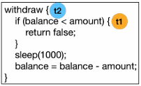

# 실행 과정

<figure><figcaption></figcaption></figure>

**`write()` 시스템 콜 호출 예시 (x86 기준)**

1. 라이브러리 함수(printf)를 호출한다.
2. 라이브러리 함수 내부에서 시스템 콜(write)를 호출한다.
3. 해당 시스템 콜의 인덱스(4)를 CPU 레지스터에 저장한다.
4. 0x80 인터럽트를 발생시킨다.(커널 모드로 전환)
5. IDT(Interrupt Descriptor Table)를 참조하여 system\_call()을 호출한다.
6. 이때 3에서 저장한 인덱스를 system\_call() 함수 내에 전달한다.
7. sys\_call\_table을 참조해 해당 인덱스에 맞는 기능(sys\_write)을 호출한다.
8. 수행이 모두 끝나면 return-from-trap을 발생시켜 사용자 모드로 전환된다.

💡 **IDT(Interrupt Descriptor Table)**

인터럽트가 발생하였을 때 처리해주는 함수의 루틴을 포함하는 테이블

&#x20;💡 **인터럽트 서비스 루틴(ISR)**

> **특정 인터럽트가 발생했을 때 호출되는 루틴을 의미**

즉, 위에서 `0x80` 주소에 매핑된 `system_call()` 이 ISR의 한 종류이다.

