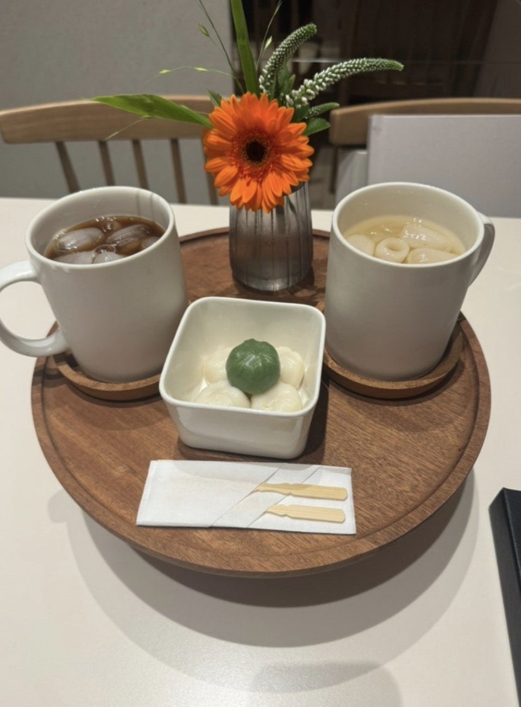
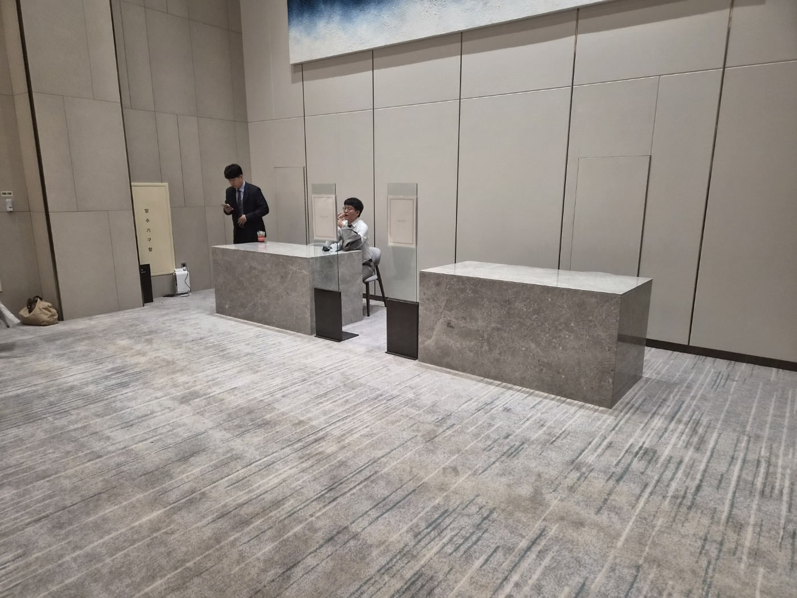
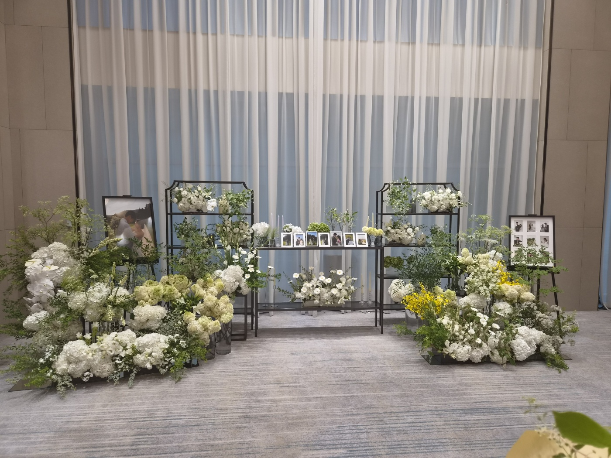
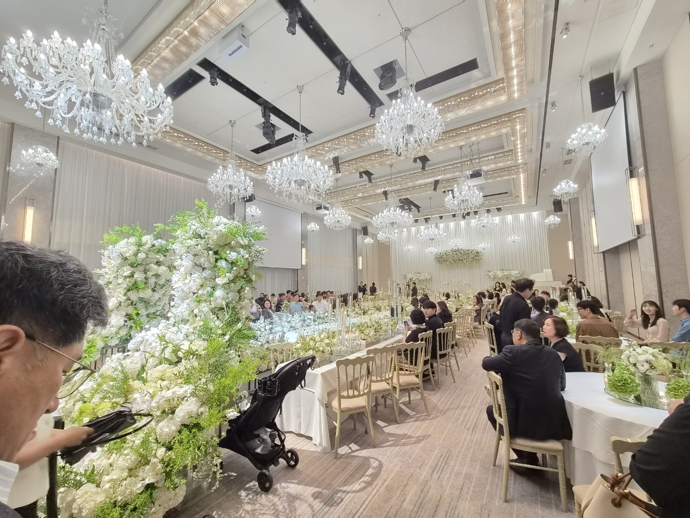
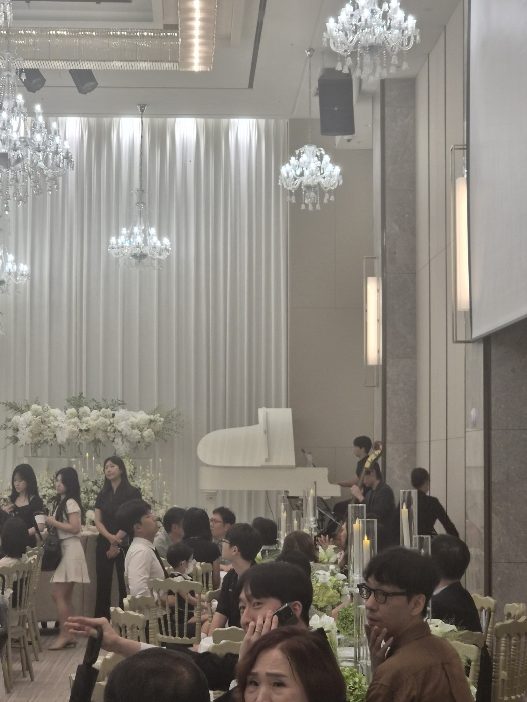
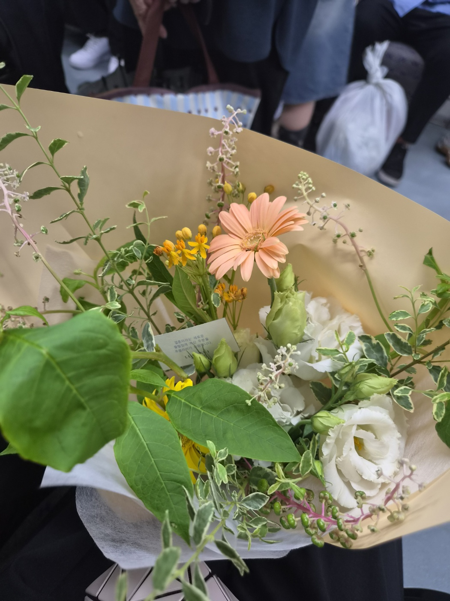

# 루클라비 더화이트 홀투어 및 상담 후기

2027년 11월이나 12월쯤으로 넉넉하게 예식을 계획하고 있지만, 인기 있는 웨딩홀은 생각보다 일찍 마감된다는 이야기를 듣고 부지런히 첫 홀투어를 다녀왔어요!

저희의 첫 번째 홀투어 장소는 처음부터 눈여겨보고 있었던 **'루클라비 더화이트'** 🤍\
첫 홀투어라 긴장 반, 설렘 반으로 방문했는데 시작부터 마지막까지 기분 좋게 둘러보고 왔답니다.

저희는 대중교통을 이용해서 방문했어요.\
학동역 8번 출구에서는 도보 약 7분, 신사역 1번 출구에서는 도보 약 8분 정도라 강남권 웨딩홀 중에서는 대중교통 접근성도 괜찮은 편이었어요. 셔틀버스도 운행한다고 안내받았습니다.

주차는 내부 150대, 외부 150대로 총 300대 정도 가능하고, 하객은 1시간 30분 무료 주차가 가능하다고 해요.

### 1. 첫인상부터 좋았던 로비와 상담

엘리베이터에서 내리자마자 가장 먼저 느껴졌던 건 **깔끔하고 세련된 분위기**였어요.

전체적으로 층고가 높아서 답답한 느낌이 없었고, 로비도 넓고 깔끔하게 정돈되어 있어서 첫인상이 좋았습니다.

예약 확인을 하고 친절하신 매니저님의 안내를 받아 상담실로 이동했어요.

상담실에서 간단한 상담카드를 작성하고 있으니 웰컴드링크와 함께 꿀떡도 준비해주셨어요.

그런데 이 꿀떡이 생각보다 정말 맛있었어요. 🍡\
예랑이도 원래 꿀떡을 좋아하는데 맛있다면서 너무 잘 먹더라고요ㅎㅎ

작은 부분이지만 처음 상담을 시작하면서 이렇게 챙겨주시니 신경써주시는 느낌이 들어서 좋았습니다.

상담카드 작성을 마치고 본격적으로 홀투어를 시작했어요!

### 2. 깔끔하고 고급스러웠던 축의대와 포토테이블

홀에 들어가기 전 축의금 접수대부터 둘러봤어요.

<figure><figcaption></figcaption></figure>

축의대는 대리석 느낌의 인테리어로 되어 있어서 군더더기 없이 깔끔했고, 전체적으로 고급스러운 분위기였어요.

하객분들이 처음 마주하는 공간이다 보니 이런 부분도 은근히 신경 쓰였는데, 복잡하거나 정신없는 느낌이 없어서 마음에 들었습니다.

그리고 바로 옆에는 포토테이블이 마련되어 있었어요.

<figure><figcaption></figcaption></figure>

포토테이블 역시 풍성한 생화로 꾸며져 있었는데 정말 예쁘더라고요.

나중에 여기에 저희 사진을 올려놓으면 어떤 느낌일지 상상하면서 한참 바라봤던 것 같아요.ㅎㅎ

### 3. 직접 보니 더 예뻤던 '더 화이트' 홀

저희가 방문했을 때는 마침 실제 예식이 진행되고 있어서 **실제 웨딩 세팅이 완료된 홀의 모습을 그대로 볼 수 있었어요.**

홀투어를 담당해주시는 매니저님이 따로 계셨는데 정말 친절하셨고, 예식이 시작되기 전 홀 조명도 하나씩 직접 보여주셔서 분위기를 비교해볼 수 있었습니다.

그리고 메인홀에 처음 들어갔을 때는 정말 입이 떡 벌어졌어요. 🤩

<figure><figcaption></figcaption></figure>

사진으로 봤을 때도 예쁘다고 생각했는데 실제로 보니 훨씬 더 화려하고 웅장했어요.

화이트&그린 톤의 풍성한 생화 장식이 버진로드를 따라 이어져 있고, 위에는 화려한 크리스탈 샹들리에가 있어서 마치 **숲속의 화려한 파티장에 들어온 것 같은 느낌**이 들었습니다.

무엇보다 마음에 들었던 건 높은 층고!

층고가 약 8m라서 실제 공간보다 훨씬 넓고 시원하게 느껴졌어요.\
홀 안에 시야를 가리는 기둥도 없어서 어느 자리에서든 예식을 비교적 편하게 볼 수 있을 것 같다는 점도 좋았습니다.

또 1시간 30분 간격의 분리예식으로 진행된다고 해서 앞뒤 예식 때문에 너무 정신없이 움직이지 않아도 될 것 같았어요.

### 4. 분위기를 더 특별하게 만들어주는 악기 연주

홀을 둘러보다가 개인적으로 눈에 들어왔던 부분이 하나 더 있었는데요.

바로 홀에서 연주하고 계시던 악기 연주팀이었어요!

<figure><figcaption></figcaption></figure>

피아노와 첼로의 생연주가 더해지니 홀 분위기가 훨씬 우아하고 로맨틱하게 느껴졌어요.

사진은 방해가 되지 않도록 멀리서 줌으로 찍었는데, 실제로 현장에서 들으니 생화 장식과 샹들리에, 음악이 어우러져서 분위기가 정말 좋았습니다.

웨딩홀 자체 분위기도 중요하지만 실제 예식에서는 음악이 주는 느낌도 큰데, 이런 부분까지 함께 경험해볼 수 있어서 좋았어요.

### 5. 연회장과 식사

연회장은 4층에 단독으로 마련되어 있고 약 600석 규모라고 안내받았어요.

좌석이 넉넉한 편이라 하객이 많더라도 비교적 여유롭게 식사할 수 있을 것 같았고, 단독 연회장이라 다른 예식 하객과 섞일 걱정도 덜할 것 같았습니다.

식사는 약 140여 가지 메뉴의 뷔페로 제공된다고 해요.\
상담을 받으면서 음식에도 꽤 신경을 쓰고 있다는 느낌을 받아서 실제 시식도 한번 해보고 싶더라고요.

하객분들 입장에서는 아무래도 식사도 중요한 부분이라 이 부분 역시 마음에 들었습니다.

### 6. 마지막까지 기분 좋았던 상담

홀투어와 상담을 모두 마치고 나오는데 마지막으로 **생화 꽃다발까지 선물로 챙겨주셨어요.** 🌸

<figure><figcaption></figcaption></figure>

생각하지 못했던 선물이라 더 기분이 좋았어요.

처음 방문했을 때 준비해주신 음료와 꿀떡부터 홀을 세세하게 보여주신 매니저님, 마지막 꽃다발까지 작은 부분 하나하나 신경 써주신다는 느낌을 받았습니다.

무엇보다 사진으로만 봤던 루클라비 더화이트의 홀을 직접 보니 **높은 층고와 풍성한 생화, 샹들리에가 만들어내는 분위기**가 정말 인상적이었어요.

첫 홀투어였는데 생각했던 것보다 훨씬 즐겁게 보고 와서 이후에 다른 웨딩홀을 볼 때도 자연스럽게 비교 기준이 될 것 같아요.

강남 쪽에서 **화려한 생화 장식, 높은 층고, 단독홀 느낌의 웨딩홀**을 찾고 계신 분들이라면 한 번쯤 직접 방문해서 보셔도 좋을 것 같습니다. 🤍
